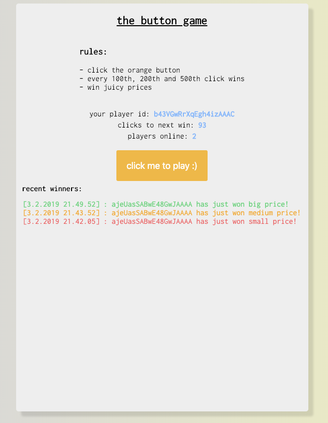

# :video_game: react-button-game :game_die:

## Preview:

## About:

Technologies used:

* **React** (frontend)
* **Node.js** (backend)
* **Socket.io** (allows real time gaming experience)

I made this application to learn and show my skills in web development.
This was my first time ever using Socket.io. Clicks will be stored in mLab (mongoose).

## How to use:

### 1. Run on your machine
Follow these steps to successfully launch this application on your own machine. Commands are hightlighted in grey.
1. Open terminal
2. `git clone git@github.com:vincenteurasto/react-button-game.git`
3. `cd react-button-game`
4. `npm install`
5. Open another terminal
6. `cd react-button-game`
7. `cd client`
8. `npm install`
9. In the first terminal `node server.js`
10. In the second terminal `npm start`

### 2. Try out live demo

https://react-button-game.herokuapp.com/

### 3. Rules:

* Click the orange button
* Every 100th, 200th and 500th click wins
* Socket.io makes sure that everyone sees player count and click count in real time.